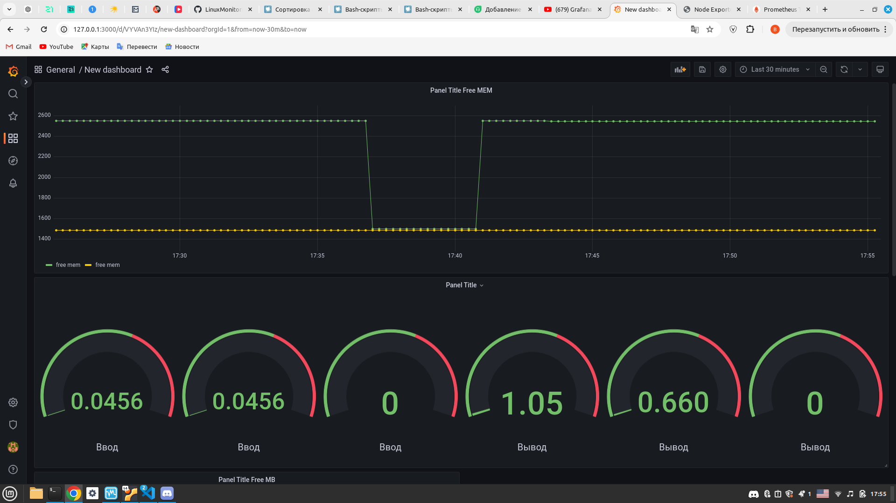
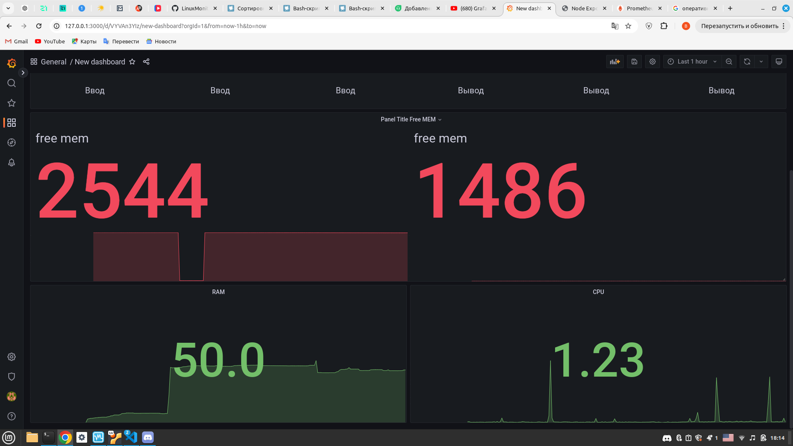

# Prometheus и Grafana

### Установить и настроить Prometheus и Grafana на виртуальную машину

```
sudo apt update && sudo apt upgrade -y
sudo apt install prometheus 
sudo systemctl start prometheus 
sudo apt-get install -y adduser libfontconfig1 musl
wget https://dl.grafana.com/oss/release/grafana_9.2.4_amd64.deb && sudo dpkg -i grafana_9.2.4_amd64.deb
sudo systemctl enable grafana-server && sudo systemctl start grafana-server
```

## Получить доступ к веб интерфейсам **Prometheus** и **Grafana** с локальной машины

* Пробрасываем парты для **3000**, **9090** </br>
* Для перехода в панель **Grafana** используем `http://localhost:3000` </br>
* При первом запуске вводим логин: `admin` и пароль: `admin`. После этого будет предложено заменить пароль<br/>
* После этого перейдем `Configuration->Data Source` и нажимаем кнопку `Add Data Source`<br/>
* В открывшемся окне выбираем тип Data Source - `Prometheus`<br/>
* В поле URL вводим адрес сервера, на котором доступен `Prometheus` и его порт. Так как `Grafana` находится на той же машине, что и `Prometheus` (порт по умолчанию 9090), используем `http://localhost:9090` <br/>
* Сохраняем изменения `Save and Test`<br/>

## Добавить на дашборд Grafana отображение ЦПУ, доступной оперативной памяти, свободное место и кол-во операций ввода/вывода на жестком диске. Запустить ваш bash-скрипт из Части 2. Посмотреть на нагрузку жесткого диска (место на диске и операции чтения/записи)



## Установить утилиту **stress** и запустить команду `stress -c 2 -i 1 -m 1 --vm-bytes 32M -t 10s`, Посмотреть на нагрузку жесткого диска, оперативной памяти и ЦПУ

1) Установим утилиту `stress`
    ```
     sudo apt install stress
    ```
2) Запустим команду
    ```
     stress -c 2 -i 1 -m 1 --vm-bytes 32M -t 60s
    ```
3) Проверим результаты работы
    <br/>