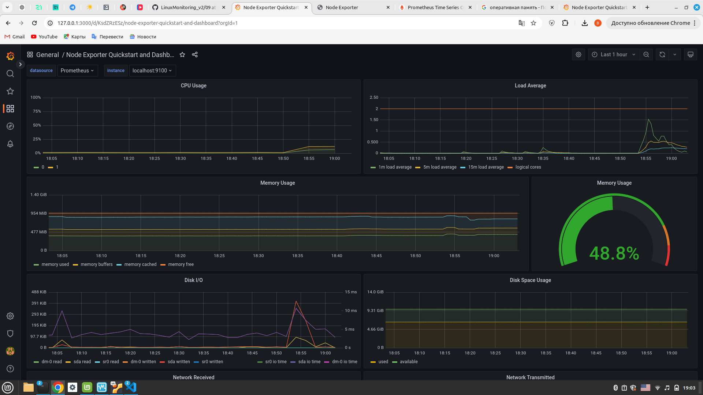
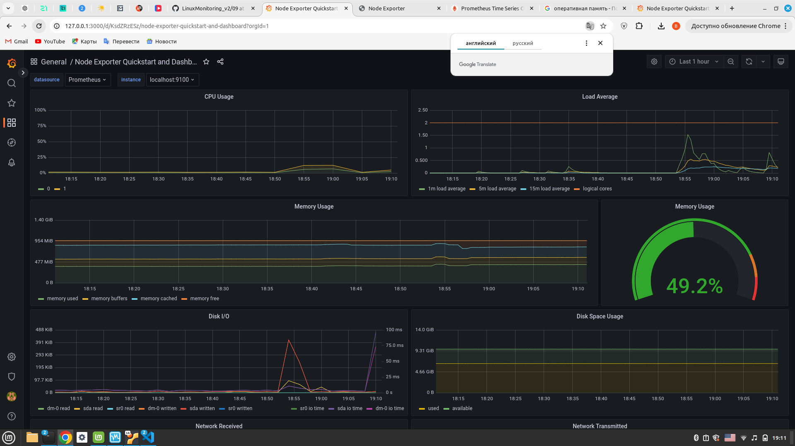
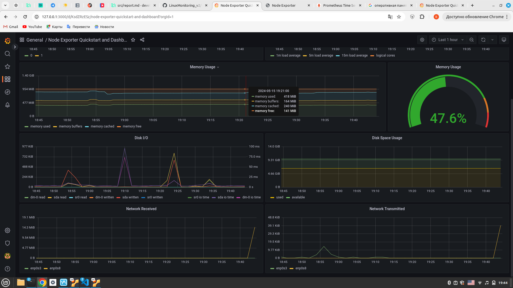

# Установить готовый дашборд Node Exporter Quickstart and Dashboard с официального сайта Grafana Labs. Провести те же тесты, что и в Части 7

## Скачиваем с официального сайта готовый дашборд **Node Exporter Quickstart and Dashboard** и добовляем его `Dashboards->Manage->Import` 

## Запускаем скрипт из **Part 2**  

## Запускаем `stress -c 2 -i 1 -m 1 --vm-bytes 32M -t 10s`  

## Запустить ещё одну виртуальную машину, находящуюся в одной сети с текущей. Запустить тест нагрузки сети с помощью утилиты iperf3. Посмотреть на нагрузку сетевого интерфейса.

