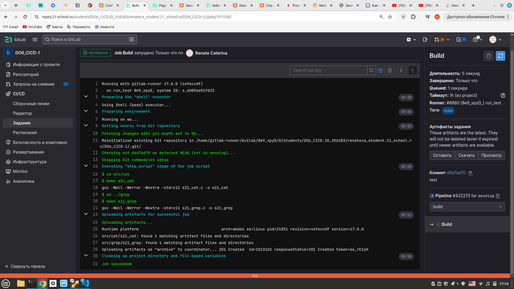
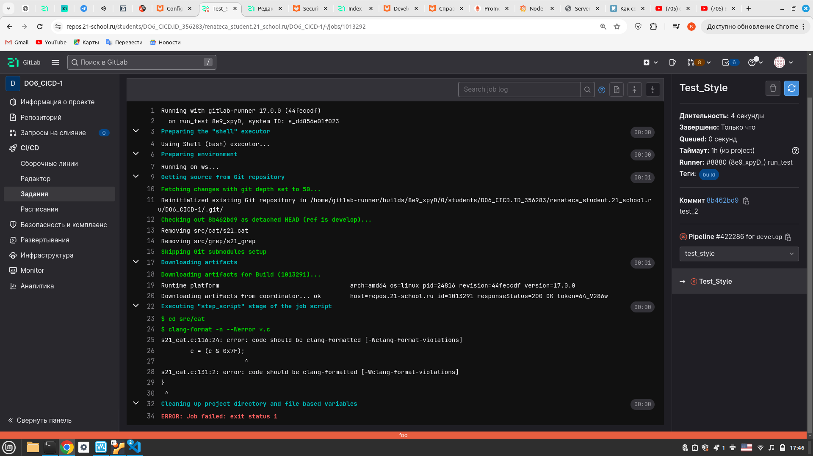
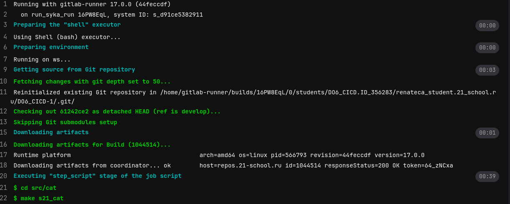
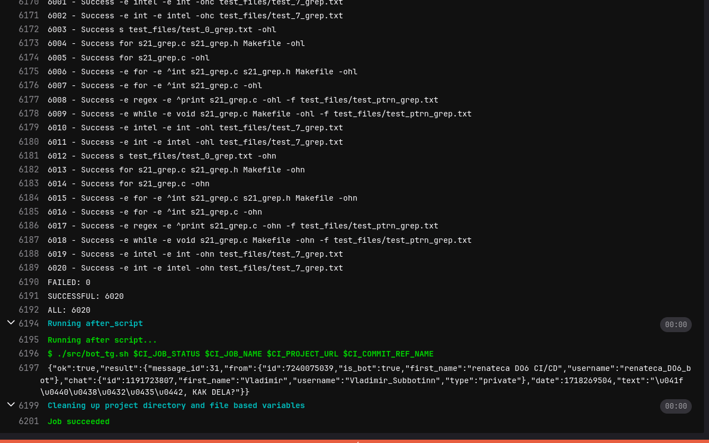
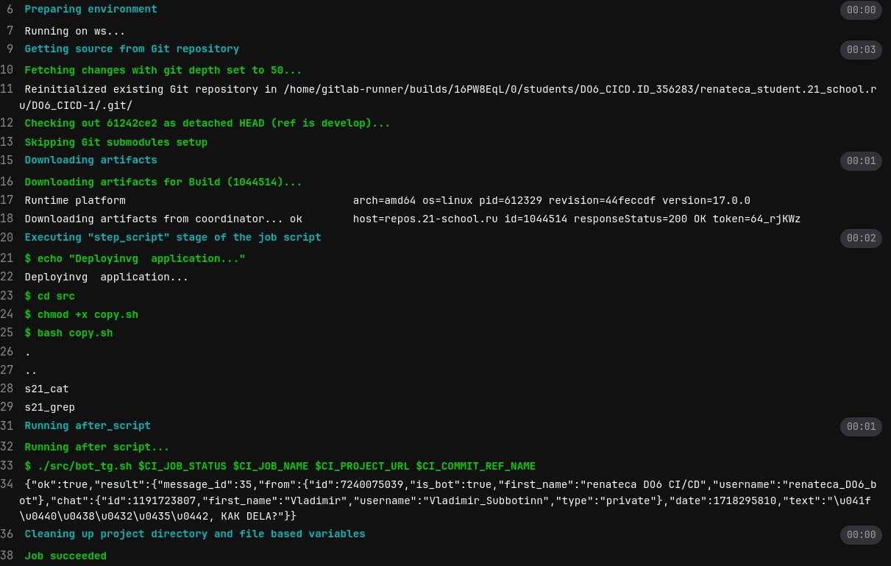

# Part 1. Настройка gitlab-runner

## Скачай и установи на виртуальную машину gitlab-runner.Запусти gitlab-runner и зарегистрируй его для использования в текущем проекте (DO6_CICD).

### Находим инструкцию на `https://docs.gitlab.com/runner/install/linux-manually.html`

<!-- sudo gitlab-runner unregister --all-runners -->

### Установка
1.  `sudo curl -L --output /usr/local/bin/gitlab-runner "https://s3.dualstack.us-east-1.amazonaws.com/gitlab-runner-downloads/latest/binaries/gitlab-runner-linux-amd64"`  
2. `sudo chmod +x /usr/local/bin/gitlab-runner`  
3. `sudo useradd --comment 'GitLab Runner' --create-home gitlab-runner --shell /bin/bash`  
4. `sudo gitlab-runner install --user=gitlab-runner --working-directory=/home/gitlab-runner`  
5. `sudo gitlab-runner start`    
### Регистрация Бегуна)

1. `sudo gitlab-runner register`  
2. URL <URL_from_the_platform> 
3. token <token_from_the_platform>
4. ...
5. Enter an executor: "shell"

## Part 2. Билд 

  

## Part 3. Code Style 

   *Если кодстайл непроходит, пайплайн фэйлится*  

## Part 4. Code test

 
 

## Part 5. Деплой 

1. Поднимаем вторую ВИРТУАЛЬНУЮ машину 
2. Настраиваем сеть между первой и второй машинами (Я взял 10.10.0.1\18 и 10.10.0.2\18)
3. Переключаемся на пользователья gitlab-runner командой `sudo -su gitlab-runner`
4. Генерируем ключ командой `ssh-keygen` и командой `ssh-copy-id USER@IP_HOST_WS2` копируем этот ключ на вторую машину  

